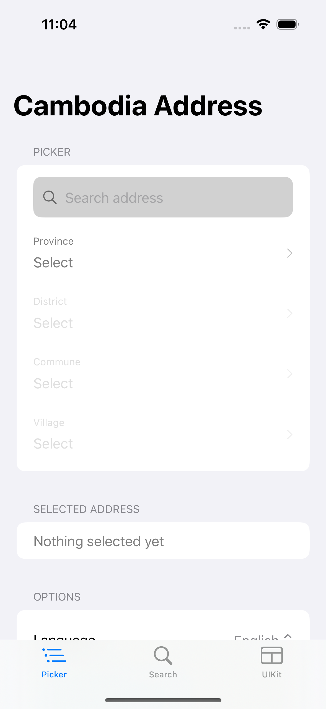
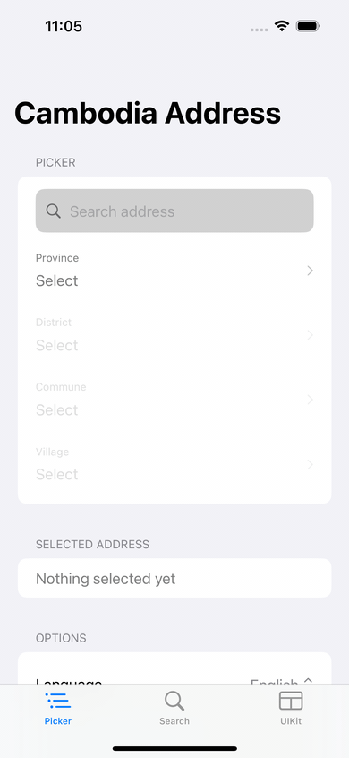
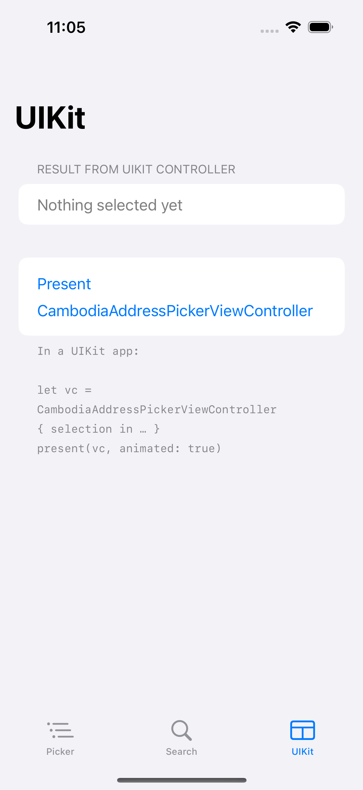
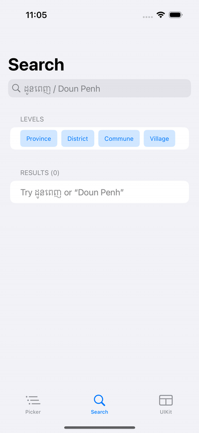

# CambodiaAddressSDK

[](https://github.com/NemSothea/CambodianAddressSDK/actions/workflows/ci.yml)
[](https://github.com/NemSothea/CambodianAddressSDK/releases/latest)
[](https://nemsothea.github.io/CambodianAddressSDK/documentation/cambodiaaddress)
[](https://swift.org)
[](https://developer.apple.com/ios/)
[](https://swift.org/package-manager/)
[](./LICENSE)

A production-ready Swift Package for picking Cambodian administrative addresses — **Province → District → Commune/Sangkat → Village** — with offline search, bilingual place names, and optional remote sync. Zero third-party dependencies.

---

<!-- TODO: Replace with a hero GIF showing the full picker flow (province → village → formatted address) -->
<!-- Example:  -->

---

## Features

| | |
|---|---|
| **Offline-first** | Full NCDD dataset bundled (~1.3 MB). Works in airplane mode, no backend required. |
| **Fast search** | Prefix + typo-tolerant fuzzy search across all 14,578 villages in Khmer and English. |
| **Bilingual** | Place names in Khmer (`ភ្នំពេញ`) and English (`Phnom Penh`), with arbitrary extra locales and graceful fallback. |
| **SwiftUI + UIKit** | Drop-in binding picker, standalone screen, and a `UIHostingController`-backed view controller. |
| **Remote sync** | Refresh the dataset from your own HTTPS endpoint. Offline-first: the update lands on the next launch. |
| **Swift 6 concurrency** | Full strict concurrency — `actor` store, `@MainActor` view models, `Sendable` everywhere. No data races. |
| **Modular** | Five targets in a strict dependency line. Depend only on `CambodiaAddressCore` for headless/server use. |
| **Tested** | 139 unit + integration tests, no third-party test dependencies. |

---

## Requirements

- **iOS 18+**
- **Swift 6 / Xcode 16+**

---

## Installation

### Swift Package Manager

**Xcode:** File → Add Package Dependencies… and enter:

```
https://github.com/NemSothea/CambodianAddressSDK.git
```

**`Package.swift`:**

```swift
dependencies: [
    .package(url: "https://github.com/NemSothea/CambodianAddressSDK.git", from: "1.3.0")
],
targets: [
    .target(name: "MyApp", dependencies: [
        .product(name: "CambodiaAddress", package: "CambodianAddressSDK")
    ])
]
```

> **Headless / server use?** Depend on `CambodiaAddressCore` instead — it has no SwiftUI/UIKit import and links against Foundation only.

---

## Quick Start

Three lines to get a working address picker:

```swift
import SwiftUI
import CambodiaAddress

struct ContentView: View {
    @State private var address = AddressSelection()

    var body: some View {
        CambodiaAddressPicker(selection: $address)
            .addressLanguage(.khmer)
    }
}
```

`address` updates as the user picks each level. Access the result:

```swift
address.province?.name.en   // "Phnom Penh"
address.district?.name.km   // "ដូនពេញ"
address.isComplete           // true once village is chosen
```

---

## Usage

### 1. Drop-in SwiftUI picker

<!-- TODO: Add screenshot of CambodiaAddressPicker rendered in a form -->
<!-- Example:  -->

```swift
import CambodiaAddress

struct CheckoutView: View {
    @State private var address = AddressSelection()

    var body: some View {
        Form {
            CambodiaAddressPicker(selection: $address)
                .addressLanguage(.khmer)   // .english · .system (follows device locale)
        }
    }
}
```

The binding is two-way: you can pre-seed `address` with a saved selection and the picker will rehydrate its child lists automatically.

### 2. Standalone screen

<!-- TODO: Add GIF of AddressPickerView presented as a sheet -->
<!-- Example:  -->

```swift
Button("Pick address") {
    showPicker = true
}
.sheet(isPresented: $showPicker) {
    AddressPickerView { address in
        save(address)
        showPicker = false
    }
}
```

### 3. UIKit

<!-- TODO: Add screenshot of CambodiaAddressPickerViewController -->
<!-- Example:  -->

```swift
let vc = CambodiaAddressPickerViewController { address in
    print(address.province?.name.en ?? "")   // "Phnom Penh"
}
present(vc, animated: true)
```

### 4. Headless (no UI)

Use the facade directly when building custom forms, running validation, or on a server:

```swift
let cambodia = CambodiaAddress.live()

let provinces = try await cambodia.provinces()
let districts = try await cambodia.districts(inProvince: "12")
let results   = try await cambodia.search("ដូនពេញ", limit: 10)
```

### 5. Configuration & Environment injection

Inject once at the root; all child views inherit the repository and language:

```swift
@main
struct MyApp: App {
    var body: some Scene {
        WindowGroup {
            ContentView()
                .cambodiaAddress(.live(.init(language: .khmer, searchLimit: 20)))
        }
    }
}
```

---

## Search

<!-- TODO: Add GIF of live search — type "doun" then "ដូន", results update -->
<!-- Example:  -->

Search works offline across all four levels, in both Khmer and English. It combines prefix matching and bounded fuzzy (Damerau-Levenshtein distance ≤ 2), so typos like `"chamkat"` still find `"Chamkar Mon"`.

```swift
let results = try await cambodia.search("doun", limit: 10)

for result in results {
    print(result.level)           // .district
    print(result.name.en)         // "Doun Penh"
    print(result.name.km)         // "ដូនពេញ"
    print(result.path.province?.name.en ?? "")  // "Phnom Penh"  ← full breadcrumb
}
```

`AddressSearchResult` carries the full parent breadcrumb in `.path` — pass it directly to `apply(_:)` on the view model to deep-link the picker to that result without extra lookups.

---

## Address Selection & Formatting

### `AddressSelection`

```swift
public struct AddressSelection: Codable, Sendable, Hashable {
    public var province: Province?
    public var district: District?
    public var commune:  Commune?
    public var village:  Village?

    public var isComplete: Bool      // true when village != nil
    public var deepestLevel: AdministrativeLevel?
}
```

Selections are value types keyed by stable NCDD codes — safe to persist in `UserDefaults`, `Codable` JSON, or CoreData. A dataset update never invalidates a saved selection.

### `AddressFormatter`

```swift
let formatter = AddressFormatter(language: .english)
formatter.string(from: address)
// → "Voat Phnum, Doun Penh, Phnom Penh"

let kh = AddressFormatter(language: .khmer)
kh.string(from: address)
// → "វត្តភ្នំ, ដូនពេញ, ភ្នំពេញ"
```

Pass `numerals: .khmer` (or `.automatic` — Khmer digits when the resolved language is Khmer) to render district/village numbers in Khmer script:

```swift
AddressFormatter(language: .khmer, numerals: .khmer).string(from: address)
// → "ផ្សារថ្មីទី​ ៣, …"    (Khmer numeral ៣ instead of 3)
```

---

## Data & Localization

The bundled dataset is the **full NCDD gazetteer** — 25 provinces, 210 districts, 1,652 communes/sangkats, and **14,578 villages**. To upgrade the dataset, drop a new `cambodia_address.json` into `Sources/CambodiaAddressData/Resources/` — no code changes required.

**Wire format:**

```jsonc
{
  "version": "2026.06",
  "provinces": [{ "code": "12", "km": "ភ្នំពេញ", "en": "Phnom Penh" }],
  "districts": [{ "code": "1201", "p": "12", "km": "ដូនពេញ", "en": "Doun Penh", "t": "khan" }],
  "communes":  [{ "code": "120103", "d": "1201", "km": "ផ្សារថ្មីទី​ ៣", "en": "Phsar Thmei Ti Bei", "t": "sangkat" }],
  "villages":  [{ "code": "12010301", "c": "120103", "km": "...", "en": "..." }]
}
```

Codes follow the NCDD convention: province = 2 digits, district = 4, commune = 6, village = 8. A child's code is always prefixed by its parent's.

### Languages & extra locales

```swift
name.resolved(for: .khmer)      // "ភ្នំពេញ"
name.resolved(for: .english)    // "Phnom Penh"
name.resolved(for: .system)     // follows Locale.current
```

Custom datasets can carry **additional locales** via an optional `i18n` map. Resolution falls back gracefully (`fr → en → km`):

```jsonc
{ "code": "12", "km": "ភ្នំពេញ", "en": "Phnom Penh", "i18n": { "fr": "Phnom Penh", "zh": "金边" } }
```

```swift
name.resolved(for: .locale("zh"))   // "金边"
name.resolved(for: .locale("de"))   // falls back → "Phnom Penh"
```

---

## Remote Sync

Keep the dataset fresh from your own HTTPS endpoint without ever going offline. `CachingDataSource` is offline-first: it immediately serves the freshest snapshot already on the device, then refreshes from the network in the background — the update is available on the next launch.

```swift
let cambodia = CambodiaAddress.live(
    .init(dataSource: .synced(URL(string: "https://yourserver.com/cambodia_address.json")!))
)
```

The remote fetch enforces HTTPS-only, a configurable response size cap, and HTTP-status + decode validation. For full control:

```swift
let remote = RemoteAddressDataSource(
    endpoint: myDatasetURL,
    configuration: .init(maximumResponseBytes: 16 * 1024 * 1024)   // 16 MB cap
)
let source = CachingDataSource(remote: remote)   // falls back to the bundled dataset offline
```

---

## Error Handling

All async SDK calls throw `AddressError`. Handle it at the repository boundary:

```swift
do {
    let provinces = try await cambodia.provinces()
} catch AddressError.resourceNotFound(let name) {
    // Bundled JSON missing — should not happen in a correctly configured app
} catch AddressError.decodingFailed(let message) {
    // JSON is malformed or the schema is incompatible
} catch AddressError.network(let message) {
    // Remote sync failed — fall back to the cached / bundled dataset
} catch AddressError.payloadTooLarge {
    // Remote response exceeded the configured size cap
} catch {
    // Unexpected error
}
```

`AddressPickerViewModel` catches all errors internally and exposes them via the `errorMessage: String?` property, so SwiftUI views don't need explicit `try/catch`.

---

## Architecture

```
CambodiaAddress             ← Umbrella facade · composition root
   ├── CambodiaAddressUI    ← SwiftUI picker + UIKit wrapper · @Observable view model
   ├── CambodiaAddressData  ← Datasources · AddressStore actor · DefaultAddressRepository
   ├── CambodiaAddressSearch← Khmer normalizer · prefix index · Damerau-Levenshtein fuzzy
   └── CambodiaAddressCore  ← Domain models · protocols · formatter  (Foundation only)
```

Key design decisions:

- **Dependency inversion** — UI depends on `AddressRepository` (protocol in Core), never on concrete data loading. Swap in `InMemoryDataSource` for tests with zero mock frameworks.
- **Actor-based caching** — `AddressStore` is an `actor`. The dataset loads exactly once across concurrent callers; all parent→child index dictionaries are built at that point.
- **Value semantics** — every model is an immutable `struct` (`Codable, Sendable, Hashable`). Identity is the stable NCDD code string, never an array index.
- **No singletons** — `CambodiaAddress.live()` is a composition root; everything is injected. Use multiple instances for multi-tenant or testing scenarios.

See [`ARCHITECTURE.md`](./ARCHITECTURE.md) for the full contract and [`BUILD_PLAN.md`](./BUILD_PLAN.md) for the build phases.

---

## Testing

The SDK ships with **139 tests** across five targets:

| Target | What's tested |
|---|---|
| `CambodiaAddressCoreTests` | Model decoding, `LocalizedName.resolved`, `AddressFormatter`, selection invariants |
| `CambodiaAddressDataTests` | Repository linkage, lazy single-load, concurrency, remote sync, caching, wire format |
| `CambodiaAddressSearchTests` | Khmer normalization, prefix correctness, fuzzy bounds, ranking, p95 < 16 ms on 25k dataset |
| `CambodiaAddressUITests` | `AddressPickerViewModel` state transitions, debounce, stale-result guards, reset cascade |
| `CambodiaAddressTests` | End-to-end facade tests against the bundled NCDD dataset |

Run locally:

```bash
swift test
```

No mocking frameworks — all fakes are hand-written `InMemoryDataSource` / `FakeAddressRepository` conformances.

---

## Example App

A runnable tab-based showcase lives in [`ExampleApp/`](./ExampleApp):

| Tab | Shows |
|---|---|
| **Picker** | Drop-in `CambodiaAddressPicker`, formatted output, Khmer/English toggle, sheet presentation |
| **Search** | Live offline search, level filters, result badges, breadcrumb paths |
| **UIKit** | `CambodiaAddressPickerViewController` presented modally |

To run it:

```bash
cd ExampleApp
xcodegen generate        # requires: brew install xcodegen
open CambodiaAddressExample.xcodeproj
```

See [`ExampleApp/README.md`](./ExampleApp/README.md) for details.

---

## Documentation

Full API reference (DocC) is hosted at:
**[nemsothea.github.io/CambodianAddressSDK](https://nemsothea.github.io/CambodianAddressSDK/documentation/cambodiaaddress)**

It rebuilds automatically on every push to `main`.

---

## Roadmap

| Version | Status | What's included |
|---|---|---|
| **v1.x** | ✅ Done | Province / District / Commune / Village · offline JSON · search · SwiftUI + UIKit · NCDD dataset |
| **v2.x** | ✅ Done | Multi-locale place names (`+` arbitrary locales via `.locale("fr")` with fallback) · Khmer-numeral formatting |
| **v3.x** | ✅ Done (sync) | `RemoteAddressDataSource` + `CachingDataSource`, offline-first API sync · GPS → nearest commune & postal codes pending (blocked on geodata) |
| **v4.x** | Planned | MapKit integration · reverse geocoding · address validation |

See the full [release history →](https://github.com/NemSothea/CambodianAddressSDK/releases)

---

## API Stability

This SDK follows **Semantic Versioning**. The public surface area (types, protocols, and methods exported by the `CambodiaAddress` and `CambodiaAddressCore` products) will not have breaking changes within a major version. Internal types (`AddressStore`, `SearchIndex`, `DatasetDecoding`, etc.) are not part of the public API.

---

## Contributing

Contributions are welcome — bug fixes, dataset updates, and new locales especially.

1. Fork the repo and create a feature branch.
2. Run `swift test` — all 139 tests must pass with zero warnings under Swift 6 strict concurrency.
3. Follow the conventions in [`ARCHITECTURE.md`](./ARCHITECTURE.md): no third-party deps in shipping targets, no `fatalError` stubs, public API gets `///` doc comments.
4. Open a pull request against `main`.

> For significant changes, open an issue first to discuss the approach.

---

## Acknowledgements

The bundled administrative dataset is derived from [**pumi**](https://github.com/dwilkie/pumi) (MIT licensed), which compiles geodata from the **NCDD** (National Committee for Sub-National Democratic Development) gazetteer — <http://db.ncdd.gov.kh/gazetteer>. Khmer names, romanized names, and NCDD codes originate there.

---

## License

MIT — see [LICENSE](./LICENSE).

The bundled dataset derives from pumi (MIT) / NCDD. See [THIRD_PARTY_NOTICES.md](./THIRD_PARTY_NOTICES.md) and Acknowledgements above.
